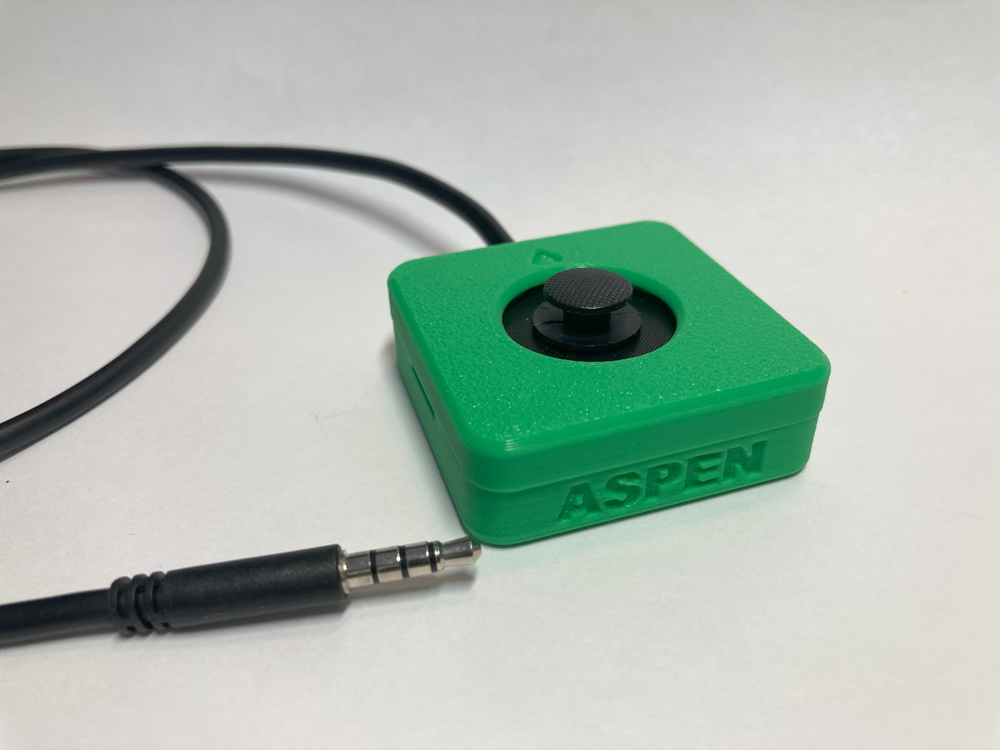
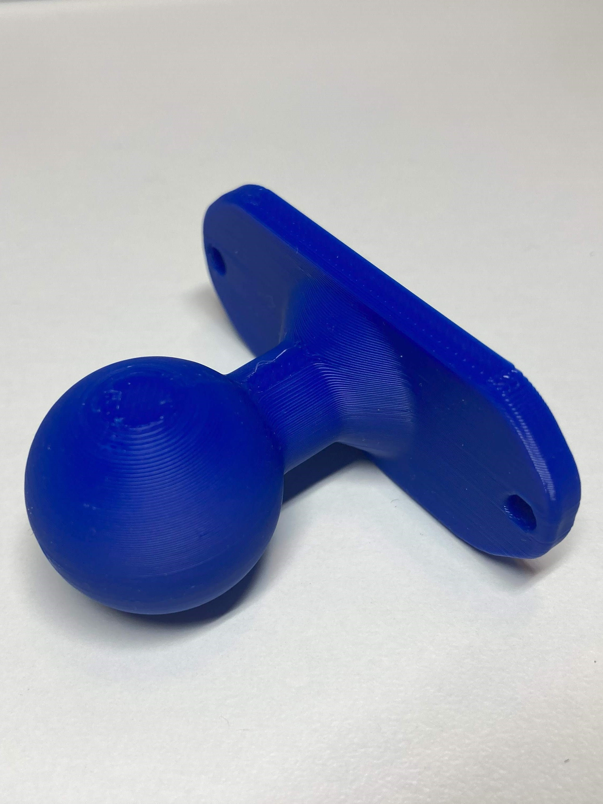
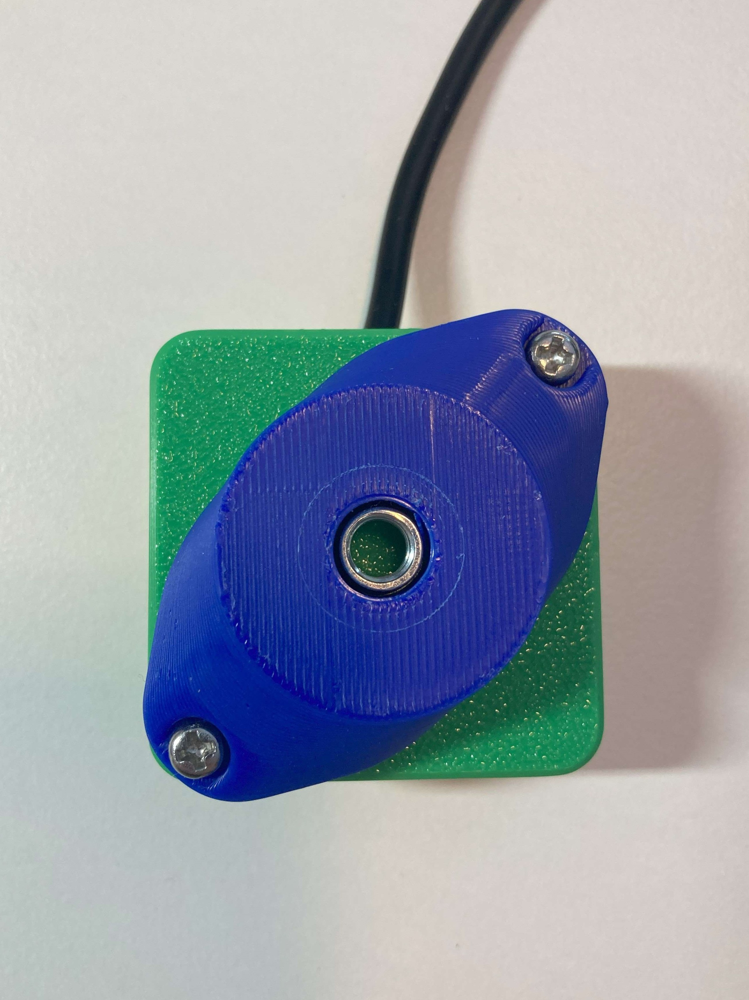
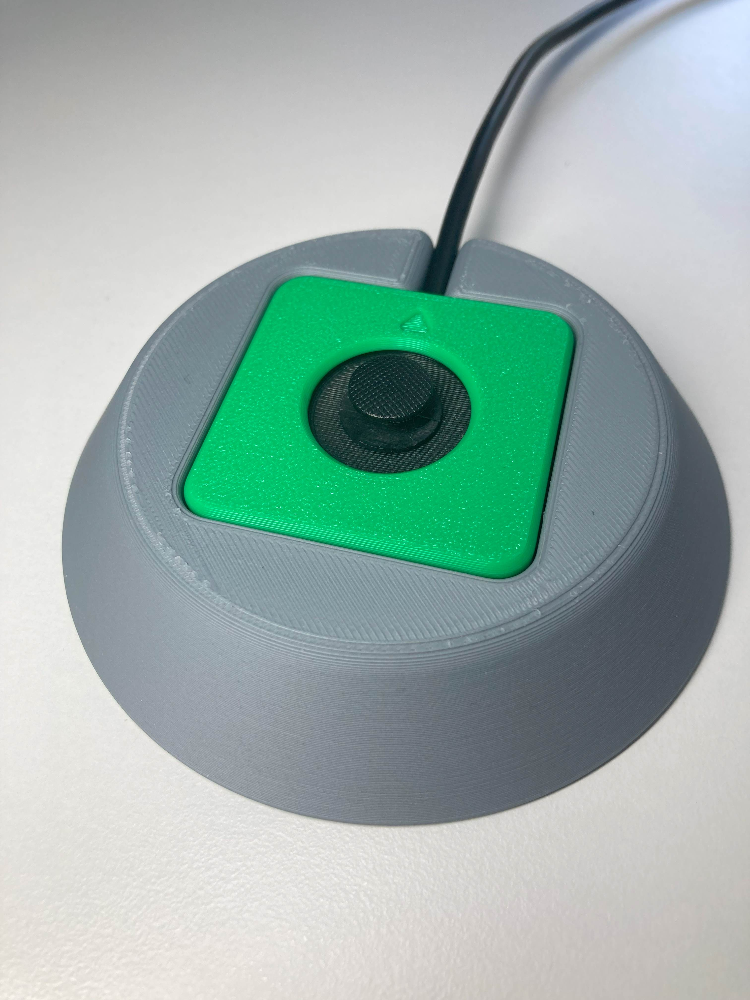

# Aspen Sliding Joystick
The Aspen Sliding Joystick is a small, proportional joystick that has a sliding motion and can be used for adaptive gaming or computer access with a suitable adapter. It has a small range of motion of ±2mm and requires approximately 115 grams-force to fully deflect. It is low profile, with a height of 1.9 cm with the standard topper. This joystick has interchangeable toppers, an optional hand support, and optional mount adapters. The Aspen Sliding Joystick has the same joystick mechanism as the Birch Sliding USB Joystick, but is the analog version. 

The Aspen Joystick has a cable with a 3.5 mm TRRS audio plug (i.e., headphone jack). It is compatible with the [Forest Joystick Mouse Hub](https://www.makersmakingchange.com/s/product/forest-joystick-mouse-hub/01tJR000000E4bdYAC), the Sony PlayStation Access Controller, or the X1 or X2 analog input ports on the Microsoft Xbox Adaptive controller.

The device is comprised of off-the-shelf electronics and 3D-printed parts. The overall cost of materials for a single build is about $20 ($12 for the materials and $8 for shipping).

The Aspen Sliding Joystick can also be used with optional mount adapters to allow for use with a 1/4-20" camera mount or RAM mount systems. There is also an optional 3D printed hand support, pictured below.

## More info at
- [Makers Making Change Assistive Device Library Listing](https://www.makersmakingchange.com/s/product/aspen-sliding-joystick/01tJR000004sCptYAE)

## How to Obtain a Aspen Sliding Joystick
### 1. Do it Yourself (DIY) or Do it Together (DIT)

This is an open-source assistive technology, so anyone is free to build it. All of the files and instructions required to build the Aspen Sliding Joystick are contained within this repository. Refer to the Maker Guide below.

### 2. Request a build of this device

If you would like to obtain an Aspen Sliding Joystick, you may submit a build request through the [MMC Library Page](https://www.makersmakingchange.com/s/product/aspen-sliding-joystick/01tJR000004sCptYAE). The requestor is responsible for the cost of materials and any shipping.

### 3. How to build this device for someone else

If you have the skills and equipment to build this device, and would like to donate your time to create the joystick for someone who needs it, visit the [MMC Maker Wanted](https://makersmakingchange.com/maker-wanted/) section.

## Getting Started

### 1. Verify Joystick Type
The Aspen Sliding Joystick is an analog joystick that uses a [TRRS](https://www.sparkfun.com/products/11580) lead to connect to an existing gamepad such as the [Forest Joystick Mouse Hub](https://www.makersmakingchange.com/s/product/forest-joystick-mouse-hub/01tJR000000E4bdYAC), the Microsoft Xbox Adaptive Controller (XAC), or the Sony PlayStation Access Controller. Verify that this is the type of joystick the user would like. 

If they want a USB joystick with the same sliding motion instead, they should be directed to the Birch Sliding USB Joystick.

<!---
Other available joysticks can be found through the [Joystick Selection Guide](https://makersmakingchange.com/resource/analog-joystick-selection-guide/)
--->

### 2. Read through the Maker Guide

The [Maker Guide](/Documentation/Aspen_Joystick_Maker_Guide.pdf) contains all the necessary information to build the device.

### 3. Read the Makers Checklist

Use the Makers Checklist in the [Maker Guide](/Documentation/Aspen_Joystick_Maker_Guide.pdf) to confirm details and customization options with the user.

### 4. Order the Off-The-Shelf Components

The [Bill of Materials](/Documentation/Aspen_Joystick_BOM.csv) lists all of the parts and components required to build the Aspen Sliding Joystick. 

### 5. Print the 3D Printable components

Print the components needed for the Aspen Sliding Joystick. Make sure to ask the user if they would like any of the optional prints such as toppers, mount adapters, or the hand support. 

All of the files and individual print files can be in the [/Build_Files/3D_Print_Files](/Build_Files/3D_Print_Files/) folder.

### 6. Assemble the Aspen Sliding Joystick

Reference the Assembly Guide section in the [Maker Guide](/Documentation/Aspen_Joystick_Maker_Guide.pdf) for the tools and steps required to build the device.

## Files
### Documentation
| Document             | Version | Link 	| 
|----------------------|---------|------------------------------------------------------------------------------------------|
| Design Rationale     | 1.0     | [Aspen_Joystick_Design_Rationale](/Documentation/Aspen_Joystick_Design_Rationale.pdf)    |
| Maker Checklist      | 1.0     | [Aspen_Joystick_Maker_Guide](/Documentation/Aspen_Joystick_Maker_Guide.pdf)           	| 
| Bill of Materials    | 1.0     | [Aspen_Joystick_Bill_of_Materials](/Documentation/Aspen_Joystick_BOM.csv)     		    |     
| User Guide           | 1.0     | [Aspen_Joystick_User_Guide](/Documentation/Aspen_Joystick_User_Guide.pdf)    	        | 
| Changelog            | 1.0     | [CHANGES](/CHANGES.txt)     			| 

### Design Files
 - [CAD Files](/Design_Files)

### Build Files
 - [3D Print Files](/Build_Files/3D_Print_Files)

## License

Everything needed or used to design, make, test, or prepare the Aspen Sliding Joystick is licensed under the CERN 2.0 Weakly Reciprocal license <https://ohwr.org/project/cernohl/wikis/Documents/CERN-OHL-version-2> (CERN-OHL-W).

Accompanying material such as instruction manuals, videos, and other copyrightable works that are useful but not necessary to design, make, test, or prepare the Aspen Sliding Joystick are published under a Creative Commons Attribution-ShareAlike 4.0 license <https://creativecommons.org/licenses/by-sa/4.0/> (CC BY-SA 4.0).

## Attribution

Contributors
- Josie Versloot, Neil Squire. Design and documentation. 

The documentation template was created by Makers Making Change / Neil Squire and is used under a CC BY-SA 4.0 license. It is available at the following link: https://github.com/makersmakingchange/OpenAT-Template

---

## About Makers Making Change

Makers Making Change is a program of [Neil Squire](https://www.neilsquire.ca/), a Canadian non-profit that uses technology, knowledge, and passion to empower people with disabilities.

Makers Making Change leverages the capacity of community-based Makers, Disability Professionals, and Volunteers to develop and deliver affordable Open Source Assistive Technologies.

 - Website: [www.MakersMakingChange.com](https://www.makersmakingchange.com/)
 - GitHub: [makersmakingchange](https://github.com/makersmakingchange)
 - X (formerly Twitter): [@makermakechange](https://twitter.com/makermakechange)
 - Instagram: [@makersmakingchange](https://www.instagram.com/makersmakingchange)
 - Facebook: [makersmakechange](https://www.facebook.com/makersmakechange)
 - LinkedIn: [Neil Squire Society](https://www.linkedin.com/company/neil-squire-society/)
 - Thingiverse: [makersmakingchange](https://www.thingiverse.com/makersmakingchange/about)
 - Printables: [MakersMakingChange](https://www.printables.com/@MakersMakingChange)

### Contact Us
For technical questions, to get involved, or to share your experience we encourage you to [visit our website](https://www.makersmakingchange.com/) or [contact us](https://www.makersmakingchange.com/s/contact).
